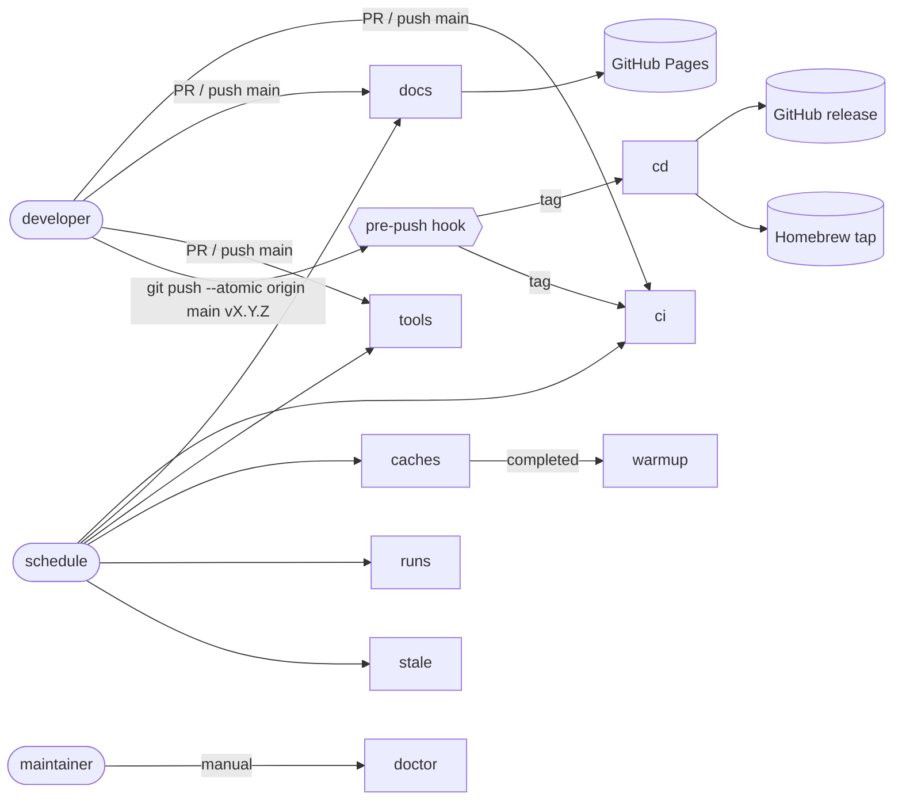
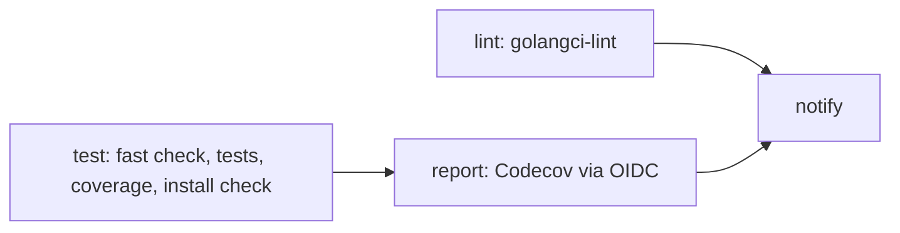
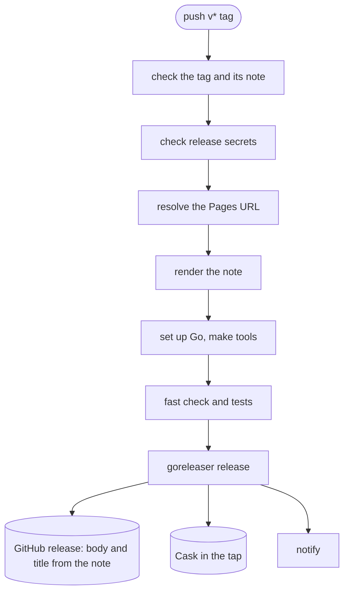
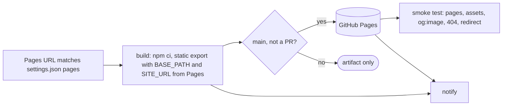
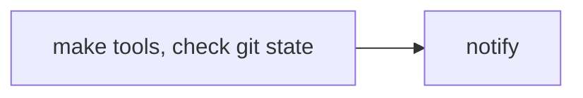
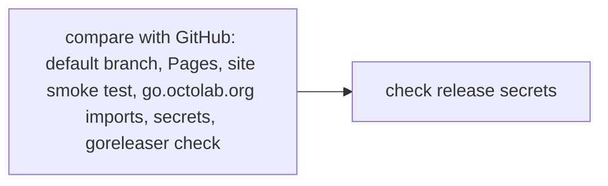
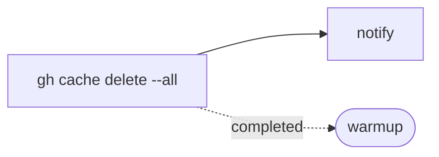
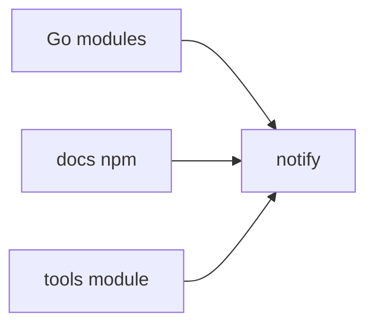
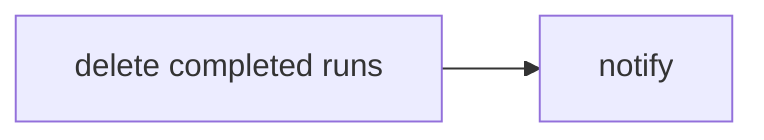
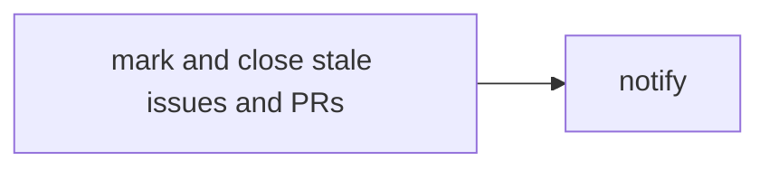

# GitHub Actions

| Workflow | Name | Runs on | Does |
| --- | --- | --- | --- |
| [ci](#ci) | Continuous integration | PR and push to main (Go files), `v*` tag, monthly, manual | Lint, tests, coverage to Codecov |
| [cd](#cd) | Continuous delivery | `v*` tag, manual | Check the tag, test, publish the release and the Homebrew Cask; a snapshot on manual runs |
| [docs](#docs) | Documentation delivery | PR and push to main (`docs/`), monthly, manual, reusable | Build the site; deploy it to Pages from main |
| [tools](#tools) | Tools validation | PR and push to main (`tools/`), monthly, manual | Install the tools module and check generated code |
| [doctor](#doctor) | Repository doctor | manual | Compare the repository with GitHub and explain fixes |
| [caches](#caches) | Workflow caches cleanup | monthly, manual, reusable | Delete all Actions caches |
| [warmup](#warmup) | Workflow caches warmup | after caches cleanup, manual | Refill Go, docs and tools caches |
| [runs](#runs) | Workflow runs cleanup | monthly, manual, reusable | Delete completed runs, with a dry run |
| [stale](#stale) | Stale issues cleanup | daily, manual, reusable | Mark and close stale issues and PRs |

Schedules are in UTC: cleanups at 06:00, checks at 07:00, monthly on day 1.

## Common ground

- All external actions use concrete release tags. The version history, migration
  notes and verification results are in [the audit report](../reports/20260918T132440Z.md).
  Dependabot checks the `github-actions` ecosystem daily; review upstream changes
  and the action contract before accepting an update.
- GitHub-hosted Ubuntu runners (`ubuntu-24.04`) supply the runtime the actions need.
- Workflow permissions default to `contents: read`; publishing and maintenance
  jobs request more explicitly.
- Every workflow except doctor ends with a `notify` job that posts to Slack.
  `SLACK_WEBHOOK` is optional: an empty value skips the notification.
- Secrets are checked by `make doctor`, which prints how to create a missing one.

| Secret | Used by | Purpose |
| --- | --- | --- |
| `HOMEBREW_TAP_TOKEN` | cd, doctor | Push the Cask to the tap named in `.goreleaser.yml` |
| `SLACK_WEBHOOK` | all but doctor | Notifications, optional |

## ci

[ci.yml](ci.yml) keeps the main branch green and reports coverage.

- Runs on PRs and pushes to main that touch Go code, `go.mod`, `Makefile`,
  `Taskfile` or the workflow itself; on `v*` tags; monthly; manually.
- Codecov uses GitHub OIDC (`id-token: write`). The repository must be activated
  in Codecov; no `CODECOV_TOKEN` is needed.
- PRs get no notification.

## cd

[cd.yml](cd.yml) publishes a release from a tag.

- **A release is a curated note plus a tag.** Write `docs/content/changelog/<tag>.md`:
  frontmatter `title` and `description`, the first line `# <title>`, Markdown
  and HTML, no MDX, site-relative links. Commit it, tag the commit, and push the
  branch and the tag in one go: `git push --atomic origin main <tag>`.
- **Guardrails come first and fail in seconds.** The `pre-push` hook
  (`.github/hooks`, wired by `make setup`) runs `.github/scripts/release.mjs check`
  before the push leaves your machine; `make release-check TAG=<tag>` runs it on
  demand, together with the `go mod tidy` + `git-check` that `fast-check` would
  otherwise fail on only after the tag is out (ci.yml and tools.yml check it on
  main too). The first steps here repeat it for pushes that bypassed the hook, then
  verify `HOMEBREW_TAP_TOKEN` can read the tap, all before Go is even installed.
- **The note becomes the release.** `release.mjs render` strips the frontmatter
  and the H1, makes site links absolute from the Pages URL and hands the title
  to goreleaser (`release.name_template`).
- **Policy lives in `.github/settings.json`**, documented by `.github/settings.cue`:
  tag pattern, maintenance branches (e.g. `v5.*` tags on branch `v5`), note path.
- The release uses the workflow token; the Cask goes to the tap named in
  `.goreleaser.yml` with `HOMEBREW_TAP_TOKEN`. After the first Cask release,
  install with `brew install --cask octolab/tap/indexit`. macOS signing and
  notarization are not configured yet; Gatekeeper may block the binary.
- A manual run on a branch builds a snapshot and publishes nothing.

## docs

[cd.docs.yml](cd.docs.yml) builds the Nextra site and deploys it to GitHub Pages.

- Runs on PRs and pushes to main that touch `docs/`, `.github/settings.json`
  or `release.mjs`; monthly; manually; as a reusable workflow.
- Pages must use **GitHub Actions** as its source, and the `github-pages`
  environment must allow deployments from main. No `CNAME` file is needed: a
  custom domain is set in Settings → Pages and declared as `pages.cname` in
  `.github/settings.json`; the build stops while they disagree. The domain is
  baked into the build, so rebuild after changing it (see docs/README.md):
  switch Settings → Pages first, then merge the new `pages.cname`; the site
  serves stale asset paths until that deploy finishes. A fork deploying its
  own Pages must drop or change `pages.cname`.
- Independent of releases: merge a note and its new pages before tagging if the
  release must link to them from the first minute.

## tools

[tools.yml](tools.yml) keeps the tools module installable and its generated code in sync.

- Runs on PRs and pushes to main that touch `tools/` or the `Makefile`; monthly; manually.
- The job fails if installing the tools changes tracked files.

## doctor

[doctor.yml](doctor.yml) runs `release.mjs doctor` and `preflight` in CI; `make doctor` runs the first one locally.

- Daily and manual: a Pages domain change triggers no workflow, so a site
  built for the old domain is caught here. Each problem is printed with what
  to fix and where.
- `go.octolab.org` is in `GOPRIVATE`, so `go` resolves it directly: every
  vanity module in `go.mod` and `tools/go.mod` must answer `?go-get=1` over
  verified HTTPS with a `go-import` tag. A lapsed certificate fails here before
  a fresh runner hits it; `node .github/scripts/release.mjs vanity` checks
  only that.
- The workflow token cannot list secrets, so they show as `unverified` there;
  the preflight step checks the ones a release needs. Locally, `gh` needs
  `admin:org` to see organization secrets.

## caches

[cleanup.caches.yml](cleanup.caches.yml) deletes every Actions cache with the built-in GitHub CLI.

## warmup

[warmup.caches.yml](warmup.caches.yml) refills the caches right after the cleanup.

## runs

[cleanup.runs.yml](cleanup.runs.yml) deletes completed workflow runs, without age or count retention.

- To clear the history, run it with `pattern: All` (the default) and `dry_run`
  unchecked. Scheduled and reusable runs also target all workflows, Dependabot
  included. Active runs, including this one, remain.
- The upstream action also deletes orphaned runs of workflows that no longer
  exist, whatever their status or the selected workflow.

## stale

[cleanup.stale.yml](cleanup.stale.yml) marks inactive issues and PRs, then closes them.

